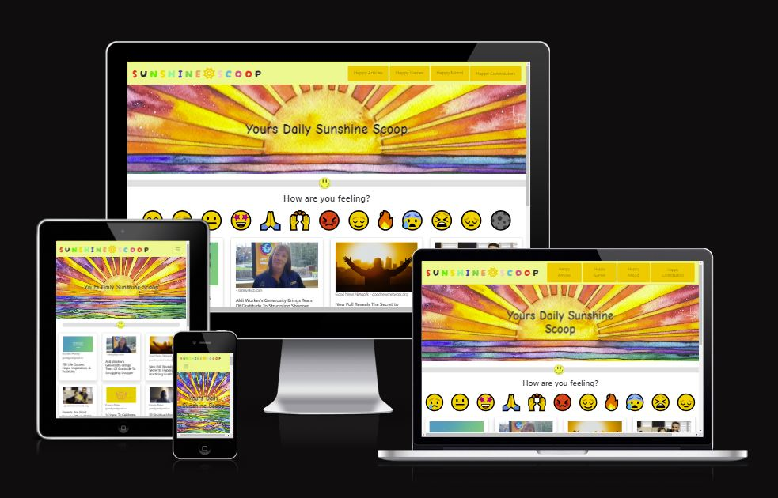

<h1 align="center"><strong> :smiley: Sunshine Scoop :smiley: </strong>

</h1>

# SUBMISSION

## Deployment
The project is deployed and can be accessed at [March Hackathon-SunshineScoop](https://sunshine-raneem-6269e592a098.herokuapp.com/).

## Criteria
In this section, we will briefly discuss how our team addressed the applicable criteria:

-  Creative Use of CSS Frameworks
We utilized CSS frameworks such as Bootstrap to create a visually appealing and intuitive design that radiates positivity. Our use of bright colors, cheerful emojis, and playful elements reflects the theme of Sunshine Squad, ensuring an enjoyable user experience.
-  Well-Executed Project with Effective Planning
Our team meticulously planned and executed the project using GitHub Projects and a detailed README.md. Through clear communication and collaboration, we organized tasks, tracked progress, and ensured that every team member contributed effectively to the project's success.
-  Strong Alignment with Hackathon Theme and Innovative Ideas
Sunshine Squad embodies the spirit of the hackathon theme by providing a unique solution to lift users' moods through positive content and interactive features. We introduced innovative ideas such as curated news feeds, gamified experiences, and a visually appealing design to differentiate our project and captivate our audience.
-  Responsiveness, Accessibility, and Thorough Testing
We prioritized responsiveness, accessibility, and thorough testing to deliver a seamless experience across devices and ensure inclusivity for all users. Our website is optimized for various screen sizes, adheres to accessibility standards, and underwent rigorous testing to identify and resolve any issues.
-  Innovative Features or Functionalities
In addition to standard requirements, Sunshine Squad offers innovative features such as personalized mood recommendations, social sharing options for positive content, and real-time updates on community achievements. These features enhance user engagement and foster a sense of community within the Sunshine Squad platform.
-  Collaborative Effort and Quality of Code
Our project exemplifies a collaborative effort, with each team member actively participating in development, design, testing, and documentation. We embraced inclusive practices, encouraged open communication, and maintained high standards of code quality to deliver a polished and cohesive final product.

# ABOUT SUBMISSION
## Intro
Welcome to Sunshine Squad, your daily dose of sunshine in the digital world! In a time where the news can often be filled with negativity and stressors, we believe in the power of positivity to uplift and inspire. Sunshine Squad is more than just a website; it's a beacon of hope, a sanctuary of joy, and a hub of happiness.

Step into a world where smiles are contagious, laughter is abundant, and every click brings a ray of sunshine into your life. Whether you're looking for heartwarming stories, delightful games, or simply a moment of respite from the chaos of everyday life, Sunshine Squad has something for everyone.

Join us on this journey to spread positivity, foster connections, and brighten each other's days, one click at a time. Let's embark on an adventure filled with laughter, love, and the simple joys that make life truly wonderful. Welcome to Sunshine Squad – where every day is a sunny day! ☀️🌈😊

## Goal

- ➡️ In today's fast-paced world, people often feel overwhelmed by negative news and stressors, impacting their mental well-being.
- ➡️ Sunshine Squad aims to address this issue by providing a refreshing escape from negativity and offering a digital oasis of positivity and happiness.
- ➡️ Our target audience includes individuals seeking a dose of positivity, relaxation, and entertainment amidst their daily routines.
- ➡️ Benefits
    - Lift your spirits with curated positive news feeds.
    - Engage in fun and uplifting games to unwind and de-stress.
    - Immerse yourself in a vibrant and cheerful design that radiates positivity.
    - Connect with like-minded individuals and spread joy within the Sunshine Squad community.

## Tech
### Frontend Technologies
- HTML: HTML (HyperText Markup Language) was used for creating the structure and content of web pages.
- CSS: CSS (Cascading Style Sheets) was used for styling the HTML elements, creating a vibrant and cheerful design of Sunshine Squad.
- JavaScript: JavaScript was used to add interactivity and dynamic features to the website, enhancing user experience with fun games and interactive elements.
- Bootstrap: Sunshine Squad utilizes Bootstrap for its grid system and pre-designed components.

### Backend Technologies
- Flask: Flask is a lightweight web framework for Python used to build the backend of the website and handle server-side logic.
- Flask Session: Flask Session extension is used to manage user sessions and store session data securely.

### Deployment and Hosting
- Heroku: Heroku is a cloud platform that enables deployment of web applications. Sunshine Squad is hosted on Heroku, providing scalability and reliability.

### Version Control and Collaboration
- Git/GitHub: Git version control system and GitHub platform are used for collaborative development, version tracking, and project management.

### Additional Tools and Practices
- Responsive Design: Media queries and responsive design techniques are employed to ensure that Sunshine Squad is optimized for various devices and screen sizes.
- Accessibility: Accessibility best practices are implemented to ensure that Sunshine Squad is usable and navigable for all users, including those with disabilities.
- Testing Frameworks: Testing frameworks such as pytest are used to conduct unit tests, integration tests, and end-to-end tests to ensure the functionality and reliability of Sunshine Squad.
- Third-Party APIs: Third-party APIs may be utilized to fetch positive news feeds, or other external data sources to enrich the content and functionality of Sunshine Squad. [Perigon](https://www.goperigon.com/).

## Wireframes

- Homepage Wireframe
[Homepage Wireframe](readme/newwireframe1.png)

- Create Booking Wireframe
[Game Wireframe](readme/newwireframe2.png)

# Features

A mood dial to alter the color depending on your current diposition. And an interactive display of emojis where the user can recieve various uplifting quotes to brighten mood.

The user can search through positive news feeds to increase mood and faith in humanity.

The user has a choice of three games to highten adreniline.

A littany of jokes and cute animals to provide humour and capture the heart of any user.

## Credits
Sources used
[Goperigon](https://www.goperigon.com/).
[Adobe Stock](https://stock.adobe.com/).

## Acknowledgements
The Sunshine Squad is a dynamic group of individuals united by a shared passion for spreading joy and positivity through technology. Comprising talented developers, designers, and creative minds, the team has dedicated the last few days to crafting an online experience that serves as a beacon of happiness for its users. With a collective vision to create a digital oasis of positivity, the Sunshine Squad has worked tirelessly to develop a website that not only lifts moods but also brightens spirits. Through collaborative effort, innovative ideas, and a commitment to excellence, the team has transformed their vision into reality, delivering a platform that radiates warmth and boundless optimism.
Thanks to
- Alex Small
- Arathi
- Denis
- Elina
- Felipe
- Mark young
- Raneem
